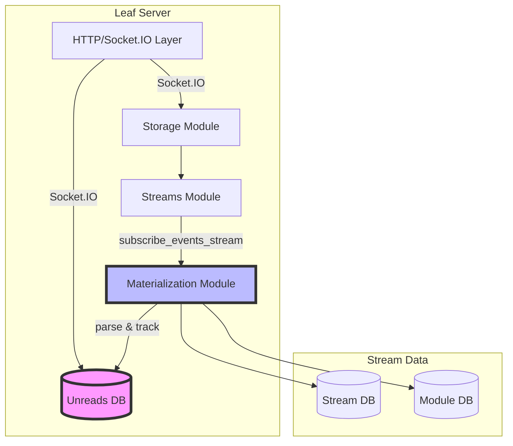
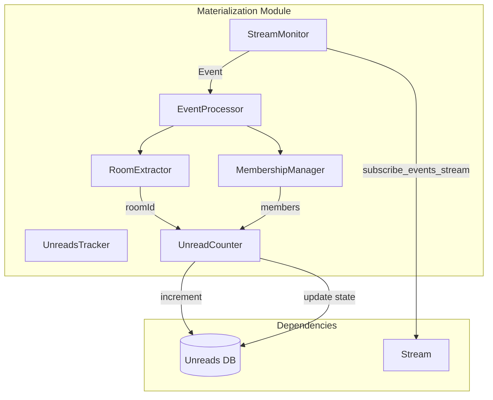
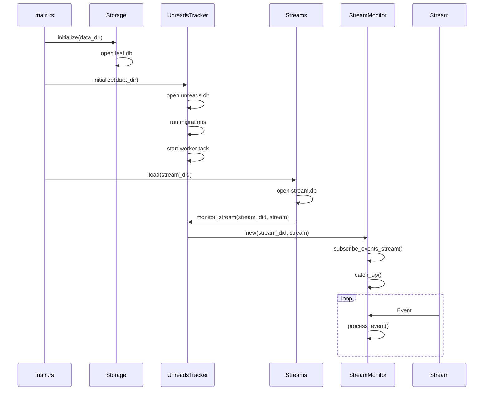
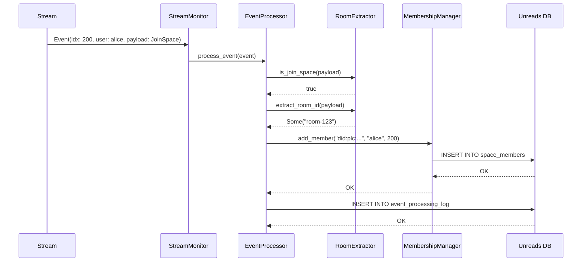
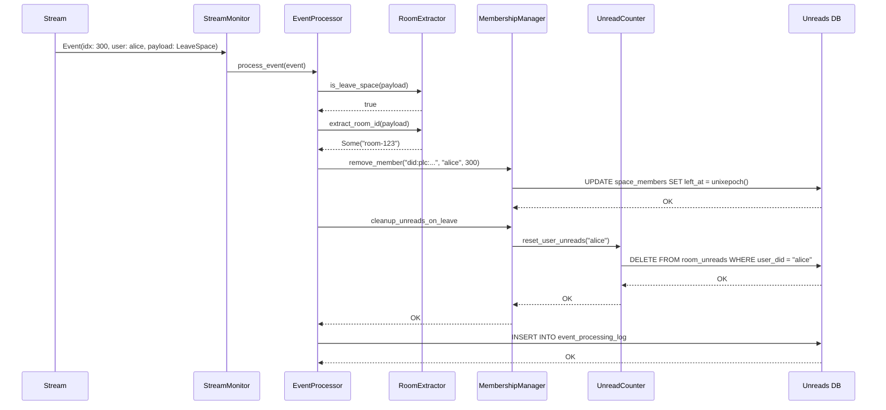
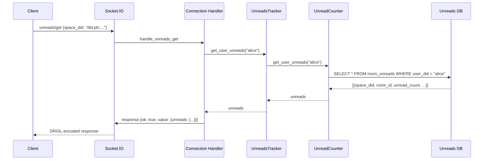
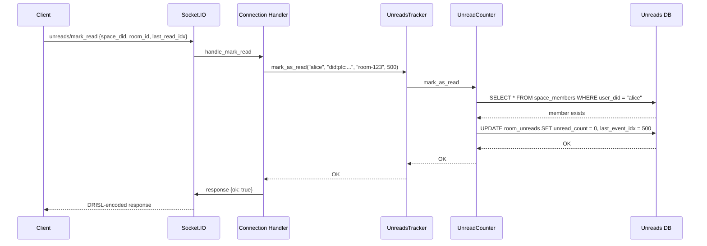
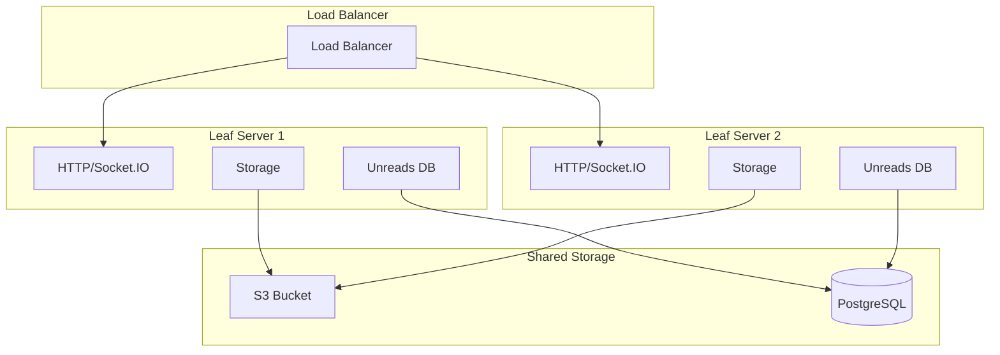

# Unread Tracking System Design

## Executive Summary

This document provides a comprehensive design for an unread tracking system for the leaf-server. The system will track unread message counts per user per room, manage space membership, and expose functionality via socket.io endpoints. The design is focused on leaf-server, separate from the leaf-stream package.

## Table of Contents

1. [Architecture Overview](#architecture-overview)
2. [Database Schema](#database-schema)
3. [Materialization Module Architecture](#materialization-module-architecture)
4. [Integration Points](#integration-points)
5. [Socket.io Endpoints](#socket-io-endpoints)
6. [Data Flow](#data-flow)
7. [Error Handling](#error-handling)
8. [Performance & Scalability](#performance--scalability)
9. [Security Considerations](#security-considerations)

---

## Architecture Overview

### System Components



### Key Design Decisions

1. **Separate Database**: The unreads tracking uses a dedicated SQLite database (`unreads.db`) separate from the main `leaf.db` and stream-specific databases. This ensures:
    - Isolation of concerns
    - Independent scaling potential
    - Easier backup/restore operations
    - No performance impact on stream operations

2. **Event-Driven Materialization**: A dedicated materialization module subscribes to all stream events and processes them asynchronously. This:
    - Doesn't block event processing
    - Provides fault tolerance
    - Allows for replay/catch-up scenarios

3. **DRISL Payload Parsing**: Events contain DRISL-encoded payloads. The materializer:
    - Validates DRISL format
    - Extracts `roomId` field if present
    - Handles parsing errors gracefully

4. **Membership Tracking**: Space membership is tracked via JoinSpace/LeaveSpace events:
    - JoinSpace creates member records
    - LeaveSpace removes member records and associated unread counts
    - Supports implicit membership (e.g., room creation events)

---

## Database Schema

### Unreads Database Schema (`unreads.db`)

```sql
-- ============================================================================
-- UNREADS DATABASE SCHEMA
-- Location: {data_dir}/unreads.db
-- Purpose: Track unread counts per user per room and space membership
-- ============================================================================

-- ----------------------------------------------------------------------------
-- Table: space_members
-- Purpose: Track which users are members of which spaces
-- ----------------------------------------------------------------------------
CREATE TABLE IF NOT EXISTS space_members (
    -- The DID of the space (stream)
    space_did TEXT NOT NULL,
    -- The DID of the user who is a member
    user_did TEXT NOT NULL,
    -- When the user joined the space
    joined_at INTEGER NOT NULL DEFAULT (unixepoch()),
    -- When the user left the space (NULL if still a member)
    left_at INTEGER,
    -- The event index that caused this membership change
    event_idx INTEGER,

    PRIMARY KEY (space_did, user_did),
    CHECK (left_at IS NULL OR left_at >= joined_at)
) STRICT;

-- Index for querying active members of a space
CREATE INDEX IF NOT EXISTS idx_space_members_active
    ON space_members(space_did)
    WHERE left_at IS NULL;

-- Index for querying spaces a user is a member of
CREATE INDEX IF NOT EXISTS idx_space_members_user
    ON space_members(user_did)
    WHERE left_at IS NULL;

-- ----------------------------------------------------------------------------
-- Table: room_unreads
-- Purpose: Track unread counts per user per room within a space
-- ----------------------------------------------------------------------------
CREATE TABLE IF NOT EXISTS room_unreads (
    -- The DID of the space (stream)
    space_did TEXT NOT NULL,
    -- The room ID (extracted from event payloads)
    room_id TEXT NOT NULL,
    -- The DID of the user who has unreads
    user_did TEXT NOT NULL,
    -- Count of unread messages
    unread_count INTEGER NOT NULL DEFAULT 0,
    -- Count of mentions (messages where user was @mentioned)
    mention_count INTEGER NOT NULL DEFAULT 0,
    -- The last event index that was processed for this room
    last_event_idx INTEGER,
    -- Timestamp of last update
    updated_at INTEGER NOT NULL DEFAULT (unixepoch()),

    PRIMARY KEY (space_did, room_id, user_did),
    FOREIGN KEY (space_did, user_did)
        REFERENCES space_members(space_did, user_did)
        ON DELETE CASCADE,
    CHECK (unread_count >= 0),
    CHECK (mention_count >= 0)
) STRICT;

-- Index for querying unreads for a user across all rooms
CREATE INDEX IF NOT EXISTS idx_room_unreads_user
    ON room_unreads(user_did, space_did, unread_count DESC, mention_count DESC);

-- Index for querying unreads in a specific room
CREATE INDEX IF NOT EXISTS idx_room_unreads_room
    ON room_unreads(space_did, room_id)
    WHERE unread_count > 0 OR mention_count > 0;

-- Index for querying all unreads in a space
CREATE INDEX IF NOT EXISTS idx_room_unreads_space
    ON room_unreads(space_did)
    WHERE unread_count > 0 OR mention_count > 0;

-- ----------------------------------------------------------------------------
-- Table: materialization_state
-- Purpose: Track the materialization progress for each stream
-- ----------------------------------------------------------------------------
CREATE TABLE IF NOT EXISTS materialization_state (
    -- The DID of the stream
    stream_did TEXT NOT NULL PRIMARY KEY,
    -- The last event index that was materialized
    last_event_idx INTEGER NOT NULL DEFAULT 0,
    -- Timestamp of last successful materialization
    last_materialized_at INTEGER NOT NULL DEFAULT (unixepoch()),
    -- Status of materialization
    status TEXT NOT NULL DEFAULT 'active', -- 'active', 'paused', 'error'
    -- Error message if status is 'error'
    error_message TEXT
) STRICT;

-- ----------------------------------------------------------------------------
-- Table: event_processing_log
-- Purpose: Log of processed events for debugging and replay
-- ----------------------------------------------------------------------------
CREATE TABLE IF NOT EXISTS event_processing_log (
    -- Auto-incrementing ID
    id INTEGER PRIMARY KEY AUTOINCREMENT,
    -- The DID of the stream
    stream_did TEXT NOT NULL,
    -- The event index
    event_idx INTEGER NOT NULL,
    -- The user who sent the event
    user_did TEXT NOT NULL,
    -- Extracted room_id (NULL if not found)
    room_id TEXT,
    -- Event type (discriminant from DRISL payload)
    event_type TEXT,
    -- Whether this event incremented unreads
    incremented_unreads INTEGER NOT NULL DEFAULT 0,
    -- Timestamp when processed
    processed_at INTEGER NOT NULL DEFAULT (unixepoch()),

    UNIQUE (stream_did, event_idx)
) STRICT;

-- Index for querying processing history
CREATE INDEX IF NOT EXISTS idx_event_processing_log_stream
    ON event_processing_log(stream_did, event_idx DESC);

-- Purge old logs (keep last 10000 per stream)
CREATE TRIGGER IF NOT EXISTS purge_old_logs
AFTER INSERT ON event_processing_log
WHEN (SELECT COUNT(*) FROM event_processing_log
      WHERE stream_did = NEW.stream_did) > 10000
BEGIN
    DELETE FROM event_processing_log
    WHERE id = (
        SELECT id FROM event_processing_log
        WHERE stream_did = NEW.stream_did
        ORDER BY id ASC
        LIMIT 1
    );
END;
```

### Schema Design Rationale

#### space_members Table

- **Purpose**: Central source of truth for space membership
- **Design Choices**:
    - Composite primary key ensures one record per user per space
    - `left_at` column allows historical tracking and re-join detection
    - `event_idx` links membership changes to specific events
    - Partial indexes on `left_at IS NULL` optimize active membership queries

#### room_unreads Table

- **Purpose**: Track unread counts per user per room
- **Design Choices**:
    - Composite primary key ensures one record per user per room
    - Foreign key cascade delete ensures cleanup when users leave spaces
    - Separate `unread_count` and `mention_count` for different notification types
    - `last_event_idx` enables incremental processing and replay
    - Partial indexes on counts > 0 optimize unread queries

#### materialization_state Table

- **Purpose**: Track materialization progress per stream
- **Design Choices**:
    - Single row per stream enables resumption after restart
    - Status field supports pausing/resuming materialization
    - Error message field aids debugging

#### event_processing_log Table

- **Purpose**: Debugging and audit trail
- **Design Choices**:
    - Auto-incrementing ID for chronological ordering
    - Unique constraint prevents duplicate processing
    - Trigger-based cleanup prevents unbounded growth
    - Room ID and event type extraction for analysis

---

## Materialization Module Architecture

### Module Structure



### Component Responsibilities

#### 1. UnreadsTracker (Main Entry Point)

**File**: `leaf-server/src/unreads/tracker.rs`

```rust
pub struct UnreadsTracker {
    db: Arc<libsql::Connection>,
    stream_monitors: Arc<RwLock<HashMap<Did, Arc<StreamMonitor>>>>,
    worker_tx: async_channel::Sender<WorkerMessage>,
}

pub enum WorkerMessage {
    /// A new stream has been loaded and needs monitoring
    MonitorStream { stream_did: Did, stream: Arc<Stream> },
    /// A stream should stop being monitored
    UnmonitorStream { stream_did: Did },
    /// Shutdown all monitoring
    Shutdown,
}

impl UnreadsTracker {
    /// Initialize the unreads tracker
    pub async fn initialize(data_dir: &Path) -> anyhow::Result<Self>;

    /// Start monitoring a stream
    pub async fn monitor_stream(&self, stream_did: Did, stream: Arc<Stream>) -> anyhow::Result<()>;

    /// Stop monitoring a stream
    pub async fn unmonitor_stream(&self, stream_did: Did) -> anyhow::Result<()>;

    /// Get unreads for a user
    pub async fn get_user_unreads(&self, user_did: &str) -> anyhow::Result<Vec<RoomUnread>>;

    /// Mark items as read
    pub async fn mark_as_read(
        &self,
        user_did: &str,
        space_did: &str,
        room_id: &str,
        last_read_idx: i64,
    ) -> anyhow::Result<()>;

    /// Get space members
    pub async fn get_space_members(&self, space_did: &str) -> anyhow::Result<Vec<String>>;
}
```

**Key Responsibilities**:

- Initialize and manage the unreads database
- Coordinate stream monitoring
- Provide high-level API for unreads operations
- Handle database migrations

#### 2. StreamMonitor

**File**: `leaf-server/src/unreads/stream_monitor.rs`

```rust
pub struct StreamMonitor {
    stream_did: Did,
    stream: Arc<Stream>,
    event_rx: async_channel::Receiver<Event>,
    db: Arc<libsql::Connection>,
    last_processed_idx: Arc<AtomicI64>,
}

impl StreamMonitor {
    /// Create a new stream monitor
    pub fn new(
        stream_did: Did,
        stream: Arc<Stream>,
        db: Arc<libsql::Connection>,
    ) -> (Self, async_channel::Receiver<Event>);

    /// Start the monitoring loop
    pub async fn run(&self) -> anyhow::Result<()>;

    /// Catch up on missed events
    pub async fn catch_up(&self) -> anyhow::Result<i64>;
}
```

**Key Responsibilities**:

- Subscribe to stream events via `stream.subscribe_events_stream()`
- Receive events as they arrive
- Delegate event processing to EventProcessor
- Track last processed event index
- Handle catch-up on stream load

#### 3. EventProcessor

**File**: `leaf-server/src/unreads/event_processor.rs`

```rust
pub struct EventProcessor {
    db: Arc<libsql::Connection>,
    room_extractor: RoomExtractor,
    membership_manager: MembershipManager,
    unread_counter: UnreadCounter,
}

pub struct ProcessedEvent {
    pub room_id: Option<String>,
    pub event_type: Option<String>,
    pub affected_members: Vec<String>,
    pub is_join_leave: bool,
}

impl EventProcessor {
    /// Process a single event
    pub async fn process_event(&self, event: &Event) -> anyhow::Result<ProcessedEvent>;

    /// Handle JoinSpace event
    async fn handle_join_space(&self, event: &Event, room_id: &str) -> anyhow::Result<()>;

    /// Handle LeaveSpace event
    async fn handle_leave_space(&self, event: &Event, room_id: &str) -> anyhow::Result<()>;

    /// Handle regular message event
    async fn handle_message(&self, event: &Event, room_id: &str) -> anyhow::Result<()>;
}
```

**Key Responsibilities**:

- Parse DRISL payload
- Extract event type (discriminant)
- Route to appropriate handler based on event type
- Coordinate with RoomExtractor and MembershipManager
- Update processing log

#### 4. RoomExtractor

**File**: `leaf-server/src/unreads/room_extractor.rs`

```rust
pub struct RoomExtractor;

impl RoomExtractor {
    /// Extract room_id from DRISL payload
    pub fn extract_room_id(payload: &[u8]) -> anyhow::Result<Option<String>>;

    /// Extract event type (discriminant) from DRISL payload
    pub fn extract_event_type(payload: &[u8]) -> anyhow::Result<Option<String>>;

    /// Check if event is a JoinSpace event
    pub fn is_join_space(payload: &[u8]) -> bool;

    /// Check if event is a LeaveSpace event
    pub fn is_leave_space(payload: &[u8]) -> bool;

    /// Extract mentions from payload
    pub fn extract_mentions(payload: &[u8]) -> anyhow::Result<Vec<String>>;
}
```

**Key Responsibilities**:

- Parse DRISL-encoded payloads
- Extract `roomId` field using drisl_extract logic
- Extract event discriminant for type detection
- Handle various payload structures
- Gracefully handle parsing errors

**Room ID Extraction Logic**:

The system will attempt to extract `roomId` from payloads using multiple strategies:

1. **Direct field access**: Try `payload.roomId` (case-sensitive)
2. **Nested access**: Try common nested paths like `payload.message.roomId`
3. **Discriminant-based**: For known event types, use type-specific extraction

```rust
// Example extraction strategies
const ROOM_ID_PATHS: &[&str] = &[
    ".roomId",
    ".room_id",
    ".message.roomId",
    ".message.room_id",
    ".post.roomId",
    ".post.room_id",
];

const JOIN_SPACE_TYPES: &[&str] = &[
    "JoinSpace",
    "joinSpace",
    "town.muni.event.JoinSpace",
];

const LEAVE_SPACE_TYPES: &[&str] = &[
    "LeaveSpace",
    "leaveSpace",
    "town.muni.event.LeaveSpace",
];
```

#### 5. MembershipManager

**File**: `leaf-server/src/unreads/membership_manager.rs`

```rust
pub struct MembershipManager {
    db: Arc<libsql::Connection>,
}

impl MembershipManager {
    /// Add a member to a space
    pub async fn add_member(
        &self,
        space_did: &str,
        user_did: &str,
        event_idx: i64,
    ) -> anyhow::Result<()>;

    /// Remove a member from a space
    pub async fn remove_member(
        &self,
        space_did: &str,
        user_did: &str,
        event_idx: i64,
    ) -> anyhow::Result<()>;

    /// Get all active members of a space
    pub async fn get_space_members(&self, space_did: &str) -> anyhow::Result<Vec<String>>;

    /// Check if a user is a member of a space
    pub async fn is_member(&self, space_did: &str, user_did: &str) -> anyhow::Result<bool>;

    /// Clean up unread records when user leaves
    pub async fn cleanup_unreads_on_leave(
        &self,
        space_did: &str,
        user_did: &str,
    ) -> anyhow::Result<()>;
}
```

**Key Responsibilities**:

- Manage space membership records
- Handle JoinSpace/LeaveSpace events
- Provide membership queries
- Cascade delete unread records on leave

#### 6. UnreadCounter

**File**: `leaf-server/src/unreads/counter.rs`

```rust
pub struct UnreadCounter {
    db: Arc<libsql::Connection>,
}

pub struct UnreadIncrement {
    pub user_did: String,
    pub space_did: String,
    pub room_id: String,
    pub unread_delta: i64,
    pub mention_delta: i64,
    pub event_idx: i64,
}

impl UnreadCounter {
    /// Increment unreads for multiple users
    pub async fn increment_unreads(
        &self,
        increments: Vec<UnreadIncrement>,
    ) -> anyhow::Result<()>;

    /// Mark items as read for a user
    pub async fn mark_as_read(
        &self,
        user_did: &str,
        space_did: &str,
        room_id: &str,
        last_read_idx: i64,
    ) -> anyhow::Result<()>;

    /// Get unreads for a user
    pub async fn get_user_unreads(&self, user_did: &str) -> anyhow::Result<Vec<RoomUnread>>;

    /// Get unreads for a specific room
    pub async fn get_room_unreads(
        &self,
        space_did: &str,
        room_id: &str,
    ) -> anyhow::Result<Vec<UserUnread>>;

    /// Reset unread counts for a user
    pub async fn reset_user_unreads(&self, user_did: &str) -> anyhow::Result<()>;
}
```

**Key Responsibilities**:

- Increment/decrement unread counts
- Handle mention counting
- Provide unread queries
- Mark items as read
- Batch operations for performance

### Module Initialization



---

## Integration Points

### 1. Main Server Initialization

**File**: `leaf-server/src/main.rs`

**Changes Required**:

```rust
// Add new module
mod unreads;

// In start_server function
async fn start_server(server_args: &'static ServerArgs) -> anyhow::Result<()> {
    // ... existing code ...

    // Initialize storage
    STORAGE.initialize(&ARGS.data_dir, s3_backup).await?;

    // Initialize unreads tracker (NEW)
    unreads::UNREADS_TRACKER.initialize(&ARGS.data_dir).await?;

    // Start the web API
    http::start_api(server_args).await?;

    // ... rest of code ...
}
```

### 2. Stream Loading Hook

**File**: `leaf-server/src/streams.rs`

**Changes Required**:

```rust
// In Streams::load method
pub async fn load(&self, id: Did) -> anyhow::Result<StreamHandle> {
    // ... existing code to load stream ...

    // After stream is loaded and module is provided
    let handle = Arc::new(stream);
    self.streams.write().await.insert(id.clone(), handle.clone());

    // Start monitoring for unreads (NEW)
    if let Err(e) = crate::unreads::UNREADS_TRACKER
        .monitor_stream(id.clone(), handle.clone())
        .await
    {
        tracing::warn!("Failed to start unreads monitoring for stream {id}: {e}");
    }

    Ok(handle)
}
```

### 3. HTTP/Socket.io Integration

**File**: `leaf-server/src/http/connection.rs`

**Changes Required**:

Add new socket.io handlers:

```rust
// In setup_socket_handlers function
pub fn setup_socket_handlers(socket: &SocketRef, did: Option<String>) {
    // ... existing handlers ...

    // NEW: Unreads query handler
    let span_ = span.clone();
    let did_ = did.clone();
    socket.on(
        "unreads/get",
        async move |TryData::<bytes::Bytes>(bytes), ack: AckSender| {
            let result = async {
                let Some(did_) = did_ else {
                    anyhow::bail!("Only authenticated users can query unreads");
                };
                let args: UnreadsGetArgs = dasl::drisl::from_slice(&bytes?[..])?;

                let unreads = crate::unreads::UNREADS_TRACKER
                    .get_user_unreads(&did_)
                    .await?;

                anyhow::Ok(UnreadsGetResp { unreads })
            }
            .instrument(tracing::info_span!(parent: span_.clone(), "handle unreads/get"))
            .await;

            ack.send(&response(result))
                .log_error("Internal error sending response")
                .ok();
        },
    );

    // NEW: Mark as read handler
    let span_ = span.clone();
    let did_ = did.clone();
    socket.on(
        "unreads/mark_read",
        async move |TryData::<bytes::Bytes>(bytes), ack: AckSender| {
            let result = async {
                let Some(did_) = did_ else {
                    anyhow::bail!("Only authenticated users can mark items as read");
                };
                let args: UnreadsMarkReadArgs = dasl::drisl::from_slice(&bytes?[..])?;

                crate::unreads::UNREADS_TRACKER
                    .mark_as_read(&did_, &args.space_did, &args.room_id, args.last_read_idx)
                    .await?;

                anyhow::Ok(())
            }
            .instrument(tracing::info_span!(parent: span_.clone(), "handle unreads/mark_read"))
            .await;

            ack.send(&response(result))
                .log_error("Internal error sending response")
                .ok();
        },
    );

    // NEW: Get space members handler
    let span_ = span.clone();
    let did_ = did.clone();
    socket.on(
        "unreads/space_members",
        async move |TryData::<bytes::Bytes>(bytes), ack: AckSender| {
            let result = async {
                let Some(did_) = did_ else {
                    anyhow::bail!("Only authenticated users can query space members");
                };
                let args: SpaceMembersArgs = dasl::drisl::from_slice(&bytes?[..])?;

                let members = crate::unreads::UNREADS_TRACKER
                    .get_space_members(&args.space_did)
                    .await?;

                anyhow::Ok(SpaceMembersResp { members })
            }
            .instrument(tracing::info_span!(parent: span_.clone(), "handle unreads/space_members"))
            .await;

            ack.send(&response(result))
                .log_error("Internal error sending response")
                .ok();
        },
    );
}
```

### 4. Module Structure

**New Directory Structure**:

```
leaf-server/src/
├── unreads/
│   ├── mod.rs              # Module exports and UNREADS_TRACKER singleton
│   ├── tracker.rs          # UnreadsTracker main implementation
│   ├── stream_monitor.rs   # StreamMonitor implementation
│   ├── event_processor.rs  # EventProcessor implementation
│   ├── room_extractor.rs   # RoomExtractor implementation
│   ├── membership_manager.rs # MembershipManager implementation
│   ├── counter.rs          # UnreadCounter implementation
│   └── schema.sql          # Database schema
├── main.rs                 # Add mod unreads
├── streams.rs              # Add monitoring hook
└── http/
    └── connection.rs       # Add socket.io handlers
```

---

## Socket.io Endpoints

### API Specification

All endpoints use DRISL encoding for requests and responses, consistent with the existing leaf-server API.

#### 1. Get User Unreads

**Event**: `unreads/get`

**Request**:

```rust
#[derive(Serialize, Deserialize)]
pub struct UnreadsGetArgs {
    // Optional: Filter to specific space
    pub space_did: Option<String>,
    // Optional: Filter to specific room
    pub room_id: Option<String>,
}
```

**Response**:

```rust
#[derive(Serialize, Deserialize)]
pub struct UnreadsGetResp {
    pub unreads: Vec<RoomUnread>,
}

#[derive(Serialize, Deserialize)]
pub struct RoomUnread {
    pub space_did: String,
    pub room_id: String,
    pub unread_count: i64,
    pub mention_count: i64,
    pub last_event_idx: Option<i64>,
    pub updated_at: i64,
}
```

**Behavior**:

- Returns all unread counts for the authenticated user
- Filters by `space_did` if provided
- Filters by `room_id` if provided (requires `space_did`)
- Ordered by `updated_at DESC` (most recently updated first)

**Example Usage**:

```javascript
// Get all unreads
socket.emit(
    "unreads/get",
    drisl.encode({
        space_did: null,
        room_id: null,
    }),
    (response) => {
        if (response.ok) {
            console.log("Unreads:", response.value.unreads);
        }
    },
);

// Get unreads for a specific space
socket.emit(
    "unreads/get",
    drisl.encode({
        space_did: "did:plc:abc123...",
        room_id: null,
    }),
    callback,
);

// Get unreads for a specific room
socket.emit(
    "unreads/get",
    drisl.encode({
        space_did: "did:plc:abc123...",
        room_id: "room-456",
    }),
    callback,
);
```

#### 2. Mark Items as Read

**Event**: `unreads/mark_read`

**Request**:

```rust
#[derive(Serialize, Deserialize)]
pub struct UnreadsMarkReadArgs {
    pub space_did: String,
    pub room_id: String,
    pub last_read_idx: i64,
}
```

**Response**:

```rust
pub type UnreadsMarkReadResp = (); // Empty success response
```

**Behavior**:

- Sets unread count to 0 for the specified room
- Sets `last_event_idx` to track read position
- If `last_read_idx` is greater than current `last_event_idx`, updates it
- Returns error if user is not a member of the space

**Example Usage**:

```javascript
socket.emit(
    "unreads/mark_read",
    drisl.encode({
        space_did: "did:plc:abc123...",
        room_id: "room-456",
        last_read_idx: 12345,
    }),
    (response) => {
        if (response.ok) {
            console.log("Marked as read");
        }
    },
);
```

#### 3. Get Space Members

**Event**: `unreads/space_members`

**Request**:

```rust
#[derive(Serialize, Deserialize)]
pub struct SpaceMembersArgs {
    pub space_did: String,
}
```

**Response**:

```rust
#[derive(Serialize, Deserialize)]
pub struct SpaceMembersResp {
    pub members: Vec<SpaceMember>,
}

#[derive(Serialize, Deserialize)]
pub struct SpaceMember {
    pub user_did: String,
    pub joined_at: i64,
}
```

**Behavior**:

- Returns all active members of a space
- Only includes members where `left_at IS NULL`
- Ordered by `joined_at ASC` (oldest members first)

**Example Usage**:

```javascript
socket.emit(
    "unreads/space_members",
    drisl.encode({
        space_did: "did:plc:abc123...",
    }),
    (response) => {
        if (response.ok) {
            console.log("Members:", response.value.members);
        }
    },
);
```

#### 4. Reset All Unreads (Optional)

**Event**: `unreads/reset_all`

**Request**:

```rust
pub type UnreadsResetAllArgs = (); // Empty request
```

**Response**:

```rust
pub type UnreadsResetAllResp = (); // Empty success response
```

**Behavior**:

- Resets all unread counts for the authenticated user to 0
- Useful for "mark all as read" functionality
- Returns error if user is not authenticated

**Example Usage**:

```javascript
socket.emit("unreads/reset_all", drisl.encode({}), (response) => {
    if (response.ok) {
        console.log("All unreads reset");
    }
});
```

### Subscription-Based Updates (Future Enhancement)

**Design for Real-time Updates**:

```rust
// New endpoint for subscribing to unread updates
socket.on(
    "unreads/subscribe",
    async move |TryData::<bytes::Bytes>(bytes), ack: AckSender| {
        let result = async {
            let Some(did_) = did_ else {
                anyhow::bail!("Only authenticated users can subscribe");
            };

            // Create subscription channel
            let subscription_id = Ulid::new();
            let (tx, rx) = async_channel::bounded(100);

            // Register subscription
            UNREADS_TRACKER.register_subscription(did_, subscription_id, tx).await?;

            // Spawn task to send updates
            tokio::spawn(async move {
                while let Ok(update) = rx.recv().await {
                    if socket.connected() {
                        let encoded = dasl::drisl::to_vec(&UnreadUpdate {
                            subscription_id,
                            update,
                        }).unwrap();
                        socket.emit("unreads/update", &bytes::Bytes::from_owner(encoded)).ok();
                    } else {
                        break;
                    }
                }
            });

            anyhow::Ok(SubscribeResp { subscription_id })
        }.await;

        ack.send(&response(result)).ok();
    },
);
```

---

## Data Flow

### Event Processing Flow

```mermaid
sequenceDiagram
    participant Stream as Stream
    participant Monitor as StreamMonitor
    participant Processor as EventProcessor
    participant Extractor as RoomExtractor
    participant Membership as MembershipManager
    participant Counter as UnreadCounter
    participant DB as Unreads DB

    Stream->>Monitor: Event(idx: 100, user: alice, payload)
    Monitor->>Processor: process_event(event)
    Processor->>Extractor: extract_room_id(payload)
    Extractor-->>Processor: Some("room-123")
    Processor->>Extractor: extract_event_type(payload)
    Extractor-->>Processor: Some("Message")
    Processor->>Membership: get_space_members("did:plc:...")
    Membership-->>Processor: [alice, bob, charlie]
    Processor->>Processor: filter out sender (alice)
    Processor->>Counter: increment_unreads([
        {user: bob, room: "room-123", delta: 1},
        {user: charlie, room: "room-123", delta: 1}
    ])
    Counter->>DB: UPDATE room_unreads SET unread_count = unread_count + 1
    DB-->>Counter: OK
    Counter-->>Processor: OK
    Processor->>DB: INSERT INTO event_processing_log
    DB-->>Processor: OK
    Monitor->>DB: UPDATE materialization_state SET last_event_idx = 100
```

### JoinSpace Event Flow



### LeaveSpace Event Flow



### Query Unreads Flow



### Mark as Read Flow



---

## Error Handling

### Error Categories

#### 1. DRISL Parsing Errors

**Scenario**: Event payload cannot be parsed as DRISL

**Handling Strategy**:

```rust
impl RoomExtractor {
    pub fn extract_room_id(payload: &[u8]) -> anyhow::Result<Option<String>> {
        match dasl::drisl::from_slice::<Value>(payload) {
            Ok(value) => {
                // Attempt extraction
                Self::extract_room_id_from_value(value)
            }
            Err(e) => {
                tracing::warn!(
                    "Failed to parse DRISL payload: {e}. Payload length: {}",
                    payload.len()
                );
                // Return None instead of error - event is skipped
                Ok(None)
            }
        }
    }
}
```

**Rationale**:

- Non-critical: Unread tracking shouldn't block stream operations
- Logged for debugging
- Event is skipped but processing continues

#### 2. Missing Room ID

**Scenario**: Event doesn't contain a `roomId` field

**Handling Strategy**:

```rust
impl EventProcessor {
    pub async fn process_event(&self, event: &Event) -> anyhow::Result<ProcessedEvent> {
        let room_id = self.room_extractor.extract_room_id(&event.payload)?;

        match room_id {
            Some(room_id) => {
                // Process as room event
                self.handle_room_event(event, &room_id).await
            }
            None => {
                // Log and skip - not all events are room-related
                tracing::debug!("Event {} has no room_id, skipping unread tracking", event.idx);
                Ok(ProcessedEvent {
                    room_id: None,
                    event_type: None,
                    affected_members: vec![],
                    is_join_leave: false,
                })
            }
        }
    }
}
```

**Rationale**:

- Many events (e.g., profile updates) don't have room IDs
- Skipping is expected behavior
- No error needed

#### 3. Database Errors

**Scenario**: Database write fails (e.g., constraint violation, I/O error)

**Handling Strategy**:

```rust
impl UnreadCounter {
    pub async fn increment_unreads(&self, increments: Vec<UnreadIncrement>) -> anyhow::Result<()> {
        let tx = self.db.transaction().await?;

        for increment in &increments {
            let result = tx.execute(
                r#"
                INSERT INTO room_unreads
                (space_did, room_id, user_did, unread_count, mention_count, last_event_idx)
                VALUES (?, ?, ?, ?, ?, ?)
                ON CONFLICT (space_did, room_id, user_did)
                DO UPDATE SET
                    unread_count = unread_count + ?,
                    mention_count = mention_count + ?,
                    last_event_idx = ?,
                    updated_at = unixepoch()
                "#,
                (
                    &increment.space_did,
                    &increment.room_id,
                    &increment.user_did,
                    increment.unread_delta,
                    increment.mention_delta,
                    increment.event_idx,
                    increment.unread_delta,
                    increment.mention_delta,
                    increment.event_idx,
                ),
            ).await;

            match result {
                Ok(_) => continue,
                Err(e) => {
                    tracing::error!(
                        "Failed to increment unreads for user {} in room {}: {e}",
                        increment.user_did, increment.room_id
                    );
                    // Rollback and return error
                    tx.rollback().await?;
                    return Err(e.into());
                }
            }
        }

        tx.commit().await?;
        Ok(())
    }
}
```

**Rationale**:

- Use transactions for atomicity
- Rollback on any failure
- Log detailed error information
- Propagate error to caller

#### 4. Concurrent Update Conflicts

**Scenario**: Multiple events processed simultaneously for same user/room

**Handling Strategy**:

```rust
// Use SQLite's ON CONFLICT clause for atomic increments
INSERT INTO room_unreads (...) VALUES (...)
ON CONFLICT (space_did, room_id, user_did)
DO UPDATE SET
    unread_count = unread_count + excluded.unread_count,
    mention_count = mention_count + excluded.mention_count,
    last_event_idx = max(last_event_idx, excluded.last_event_idx),
    updated_at = unixepoch()
```

**Rationale**:

- SQLite handles concurrent updates via WAL mode
- Atomic increment prevents race conditions
- `max()` ensures `last_event_idx` is always the highest

#### 5. Stream Monitor Failures

**Scenario**: Stream monitor crashes or encounters error

**Handling Strategy**:

```rust
impl StreamMonitor {
    pub async fn run(&self) -> anyhow::Result<()> {
        loop {
            match self.process_next_event().await {
                Ok(_) => continue,
                Err(e) => {
                    tracing::error!("Error processing event in stream {}: {e}", self.stream_did);

                    // Update status to error
                    self.db.execute(
                        "UPDATE materialization_state SET status = 'error', error_message = ? WHERE stream_did = ?",
                        (&e.to_string(), self.stream_did.as_str())
                    ).await?;

                    // Wait before retrying
                    tokio::time::sleep(Duration::from_secs(5)).await;

                    // Attempt to continue
                    continue;
                }
            }
        }
    }
}
```

**Rationale**:

- Log error but don't crash
- Update status in database
- Implement backoff/retry logic
- Allows manual intervention

#### 6. Membership Inconsistencies

**Scenario**: User receives unread increment but is not a member

**Handling Strategy**:

```rust
impl UnreadCounter {
    pub async fn increment_unreads(&self, increments: Vec<UnreadIncrement>) -> anyhow::Result<()> {
        for increment in &increments {
            // Verify membership before incrementing
            let is_member = self.db.query(
                "SELECT 1 FROM space_members WHERE space_did = ? AND user_did = ? AND left_at IS NULL",
                (&increment.space_did, &increment.user_did)
            ).await?.next().await.is_some();

            if !is_member {
                tracing::warn!(
                    "User {} is not a member of space {}, skipping unread increment",
                    increment.user_did, increment.space_did
                );
                continue;
            }

            // Perform increment
            // ...
        }
        Ok(())
    }
}
```

**Rationale**:

- Defensive programming
- Log inconsistencies
- Skip invalid increments
- Could trigger membership sync in future

### Error Recovery Mechanisms

#### 1. Catch-Up on Stream Load

When a stream is loaded, the materializer catches up on missed events:

```rust
impl StreamMonitor {
    pub async fn catch_up(&self) -> anyhow::Result<i64> {
        // Get last processed index from database
        let last_processed: Option<i64> = self.db.query(
            "SELECT last_event_idx FROM materialization_state WHERE stream_did = ?",
            [self.stream_did.as_str()]
        ).await?.next().await?.map(|row| row.get_value(0).unwrap().as_integer().unwrap());

        let start_idx = last_processed.unwrap_or(0) + 1;
        let latest_idx = self.stream.latest_event().await;

        if start_idx > latest_idx {
            return Ok(latest_idx);
        }

        tracing::info!(
            "Catching up stream {} from {} to {}",
            self.stream_did, start_idx, latest_idx
        );

        // Fetch and process events in batches
        for batch_start in (start_idx..=latest_idx).step_by(100) {
            let batch_end = (batch_start + 99).min(latest_idx);
            self.process_event_range(batch_start, batch_end).await?;
        }

        Ok(latest_idx)
    }
}
```

#### 2. Replay from Event Log

If corruption is detected, replay from event log:

```rust
impl UnreadsTracker {
    pub async fn replay_stream(&self, stream_did: &str, from_idx: i64) -> anyhow::Result<()> {
        tracing::warn!("Replaying stream {} from event {}", stream_did, from_idx);

        // Delete unread records for this stream after from_idx
        self.db.execute(
            "DELETE FROM room_unreads WHERE space_did = ? AND last_event_idx >= ?",
            [stream_did, from_idx]
        ).await?;

        // Reset materialization state
        self.db.execute(
            "UPDATE materialization_state SET last_event_idx = ? WHERE stream_did = ?",
            [from_idx - 1, stream_did]
        ).await?;

        // Trigger catch-up
        let monitor = self.stream_monitors.read().await.get(stream_did).cloned();
        if let Some(monitor) = monitor {
            monitor.catch_up().await?;
        }

        Ok(())
    }
}
```

---

## Performance & Scalability

### Performance Optimizations

#### 1. Database-Level Optimizations

**WAL Mode**:

```sql
PRAGMA journal_mode = WAL;
PRAGMA synchronous = NORMAL;
PRAGMA cache_size = -64000;  -- 64MB cache
PRAGMA temp_store = MEMORY;
```

**Rationale**:

- WAL allows concurrent reads and writes
- Reduces I/O contention
- Better performance for high-throughput scenarios

**Indexing Strategy**:

```sql
-- Partial indexes reduce index size
CREATE INDEX idx_room_unreads_user_active
    ON room_unreads(user_did, space_did)
    WHERE unread_count > 0 OR mention_count > 0;

-- Covering indexes for common queries
CREATE INDEX idx_space_members_covering
    ON space_members(space_did, user_did, joined_at)
    WHERE left_at IS NULL;
```

**Rationale**:

- Partial indexes only include relevant rows
- Covering indexes avoid table lookups
- Smaller indexes = faster queries

#### 2. Batch Processing

**Batch Event Processing**:

```rust
impl StreamMonitor {
    pub async fn process_event_batch(&self, events: Vec<Event>) -> anyhow::Result<()> {
        let mut increments = Vec::new();
        let mut membership_changes = Vec::new();

        for event in &events {
            let processed = self.processor.process_event(event).await?;

            if let Some(room_id) = processed.room_id {
                for member in processed.affected_members {
                    increments.push(UnreadIncrement {
                        user_did: member,
                        space_did: self.stream_did.to_string(),
                        room_id: room_id.clone(),
                        unread_delta: 1,
                        mention_delta: 0,
                        event_idx: event.idx,
                    });
                }
            }

            if processed.is_join_leave {
                membership_changes.push((event.clone(), processed));
            }
        }

        // Batch increment unreads
        if !increments.is_empty() {
            self.counter.increment_unreads(increments).await?;
        }

        // Batch membership changes
        for (event, processed) in membership_changes {
            // Process membership changes
        }

        Ok(())
    }
}
```

**Rationale**:

- Reduces database round trips
- Fewer transactions
- Better throughput

#### 3. Async Processing

**Non-blocking Event Processing**:

```rust
impl StreamMonitor {
    pub async fn run(&self) -> Result<(), StreamError> {
        let (tx, rx) = async_channel::unbounded();

        // Spawn event receiver
        let event_rx = self.stream.subscribe_events_stream().await;
        tokio::spawn(async move {
            while let Ok(event) = event_rx.recv().await {
                tx.send(event).await.ok();
            }
        });

        // Process events in worker task
        loop {
            let event = rx.recv().await?;

            // Spawn processing task
            let processor = self.processor.clone();
            tokio::spawn(async move {
                if let Err(e) = processor.process_event(&event).await {
                    tracing::error!("Error processing event {}: {e}", event.idx);
                }
            });
        }
    }
}
```

**Rationale**:

- Doesn't block event reception
- Parallel processing of multiple events
- Better throughput under load

#### 4. Connection Pooling

**Database Connection Pool**:

```rust
pub struct UnreadsTracker {
    db_pool: Arc<sqlx::SqlitePool>,  // Use connection pool
    // ...
}

impl UnreadsTracker {
    pub async fn initialize(data_dir: &Path) -> anyhow::Result<Self> {
        let db_path = data_dir.join("unreads.db");
        let pool = sqlx::SqlitePool::connect_with(
            sqlx::sqlite::SqliteConnectOptions::new()
                .filename(db_path)
                .create_if_missing(true)
        ).await?;

        // Configure pool
        let pool = pool
            .max_connections(10)
            .min_connections(2)
            .acquire_timeout(Duration::from_secs(5))
            .idle_timeout(Duration::from_secs(600));

        Ok(Self { db_pool: Arc::new(pool), ... })
    }
}
```

**Rationale**:

- Multiple concurrent database operations
- Automatic connection management
- Better resource utilization

### Scalability Considerations

#### 1. Vertical Scaling

**Current Design Supports**:

- **Users**: Tens of thousands (limited by SQLite file size)
- **Rooms**: Hundreds of thousands per space
- **Events**: Millions per stream (with WAL and proper indexing)
- **Throughput**: Thousands of events per second (with async processing)

**Bottlenecks**:

- Single SQLite database file
- Single server instance
- Memory for connection pooling

#### 2. Horizontal Scaling (Future)

**Multi-Server Architecture**:



**Migration Path**:

1. Replace SQLite with PostgreSQL for unreads database
2. Use connection pooling (PgBouncer)
3. Implement consistent hashing for stream-to-server assignment
4. Use pub/sub (Redis) for cross-server unread updates

#### 3. Data Partitioning

**By Space**:

```sql
-- Partition table by space_did (PostgreSQL)
CREATE TABLE room_unreads (
    space_did TEXT,
    room_id TEXT,
    user_did TEXT,
    unread_count INTEGER,
    -- ...
) PARTITION BY HASH (space_did);

CREATE TABLE room_unreads_p0 PARTITION OF room_unreads
    FOR VALUES WITH (MODULUS 4, REMAINDER 0);

CREATE TABLE room_unreads_p1 PARTITION OF room_unreads
    FOR VALUES WITH (MODULUS 4, REMAINDER 1);
-- ... etc
```

**Rationale**:

- Distributes data across multiple tables
- Parallel query processing
- Easier maintenance (can drop/rebuild partitions)

#### 4. Caching Strategy

**Redis Cache for Unreads**:

```rust
pub struct CachedUnreadCounter {
    counter: UnreadCounter,
    redis: Arc<redis::Client>,
}

impl CachedUnreadCounter {
    pub async fn get_user_unreads(&self, user_did: &str) -> anyhow::Result<Vec<RoomUnread>> {
        let cache_key = format!("unreads:user:{}", user_did);

        // Try cache first
        if let Ok(cached) = self.redis.get(&cache_key).await {
            if let Ok(unreads) = serde_json::from_str::<Vec<RoomUnread>>(&cached) {
                return Ok(unreads);
            }
        }

        // Cache miss - query database
        let unreads = self.counter.get_user_unreads(user_did).await?;

        // Cache for 5 minutes
        let serialized = serde_json::to_string(&unreads)?;
        self.redis.set_ex(&cache_key, &serialized, 300).await?;

        Ok(unreads)
    }

    pub async fn increment_unreads(&self, increments: Vec<UnreadIncrement>) -> anyhow::Result<()> {
        // Increment in database
        self.counter.increment_unreads(increments.clone()).await?;

        // Invalidate cache for affected users
        for increment in &increments {
            let cache_key = format!("unreads:user:{}", increment.user_did);
            self.redis.del(&cache_key).await.ok();
        }

        Ok(())
    }
}
```

**Rationale**:

- Reduces database load for read-heavy workloads
- Cache invalidation on writes
- TTL-based expiration

#### 5. Monitoring & Metrics

**Key Metrics to Track**:

- Events processed per second
- Average event processing latency
- Database query latency
- Active stream monitors count
- Unread query latency
- Cache hit/miss ratio (if caching implemented)

**Example Metrics Collection**:

```rust
use prometheus::{Counter, Histogram, IntGauge};

lazy_static! {
    static ref EVENTS_PROCESSED: Counter = register_counter!(
        "unreads_events_processed_total",
        "Total number of events processed"
    ).unwrap();

    static ref EVENT_PROCESSING_LATENCY: Histogram = register_histogram!(
        "unreads_event_processing_duration_seconds",
        "Event processing latency"
    ).unwrap();

    static ref ACTIVE_MONITORS: IntGauge = register_int_gauge!(
        "unreads_active_monitors",
        "Number of active stream monitors"
    ).unwrap();
}
```

---

## Security Considerations

### 1. Authentication & Authorization

**Socket.io Authentication**:

- All unreads endpoints require authentication
- Use existing JWT validation from `http.rs`
- User DID extracted from auth token

**Authorization Checks**:

```rust
impl UnreadCounter {
    pub async fn mark_as_read(
        &self,
        user_did: &str,
        space_did: &str,
        room_id: &str,
        last_read_idx: i64,
    ) -> anyhow::Result<()> {
        // Verify user is a member
        let is_member = self.db.query(
            "SELECT 1 FROM space_members WHERE space_did = ? AND user_did = ? AND left_at IS NULL",
            [space_did, user_did]
        ).await?.next().await.is_some();

        if !is_member {
            anyhow::bail!("User {} is not a member of space {}", user_did, space_did);
        }

        // Perform update
        // ...
    }
}
```

### 2. Input Validation

**DRISL Payload Validation**:

- Validate DRISL format before parsing
- Limit payload size (e.g., 10MB max)
- Sanitize extracted values

**SQL Injection Prevention**:

- Use parameterized queries exclusively
- Never concatenate user input into SQL

### 3. Rate Limiting

**Per-User Rate Limits**:

```rust
use tower::ServiceBuilder;
use tower_governor::{Governor, GovernorConfigBuilder};

let governor_conf = GovernorConfigBuilder::default()
    .per_second(10)
    .burst_size(30)
    .finish()
    .unwrap();

let app = Router::new()
    .layer(Governor::new(&governor_conf, &SharedState::default()))
    .route("/socket.io", get(socket_io_handler));
```

**Rationale**:

- Prevent abuse of unreads endpoints
- Protect against DoS attacks
- Fair resource allocation

### 4. Data Privacy

**User DID Protection**:

- User DIDs are sensitive identifiers
- Never log full DIDs in production
- Consider hashing for analytics

**Access Control**:

- Users can only query their own unreads
- Space members can only query space members
- Admin endpoints require elevated permissions

### 5. Audit Logging

**Event Processing Log**:

- All events logged with timestamp
- Track who sent each event
- Enable forensic analysis

**Access Log**:

```rust
impl UnreadsTracker {
    pub async fn get_user_unreads(&self, user_did: &str) -> anyhow::Result<Vec<RoomUnread>> {
        tracing::info!(user = %user_did, action = "get_user_unreads");

        let unreads = self.counter.get_user_unreads(user_did).await?;

        tracing::debug!(user = %user_did, count = unreads.len(), action = "get_user_unreads_result");

        Ok(unreads)
    }
}
```

---

## Implementation Checklist

### Phase 1: Core Infrastructure

- [ ] Create `unreads` module structure
- [ ] Implement database schema (`unreads/schema.sql`)
- [ ] Create `UnreadsTracker` singleton
- [ ] Implement database migrations
- [ ] Initialize tracker in `main.rs`

### Phase 2: Materialization

- [ ] Implement `RoomExtractor` (DRISL parsing)
- [ ] Implement `MembershipManager`
- [ ] Implement `UnreadCounter`
- [ ] Implement `EventProcessor`
- [ ] Implement `StreamMonitor`
- [ ] Add monitoring hook in `streams.rs`

### Phase 3: Socket.io Endpoints

- [ ] Add `unreads/get` handler
- [ ] Add `unreads/mark_read` handler
- [ ] Add `unreads/space_members` handler
- [ ] Add `unreads/reset_all` handler (optional)
- [ ] Define request/response types

### Phase 4: Testing

- [ ] Unit tests for each component
- [ ] Integration tests for event flow
- [ ] Load testing for performance
- [ ] Error handling tests

### Phase 5: Monitoring & Operations

- [ ] Add metrics collection
- [ ] Add health check endpoint
- [ ] Document operational procedures
- [ ] Create troubleshooting guide

---

## Conclusion

This design provides a comprehensive, production-ready unread tracking system for leaf-server. The system:

- **Separates concerns** with a dedicated database and module
- **Handles events asynchronously** without blocking stream operations
- **Parses DRISL payloads** robustly with graceful error handling
- **Tracks membership** via JoinSpace/LeaveSpace events
- **Exposes functionality** via socket.io endpoints consistent with existing API
- **Scales vertically** to support thousands of users and millions of events
- **Provides hooks** for future horizontal scaling
- **Includes security** measures for authentication, authorization, and rate limiting
- **Supports monitoring** and debugging with comprehensive logging

The design balances simplicity with extensibility, providing a solid foundation for the unread tracking feature while allowing for future enhancements like real-time subscriptions, caching layers, and horizontal scaling.
